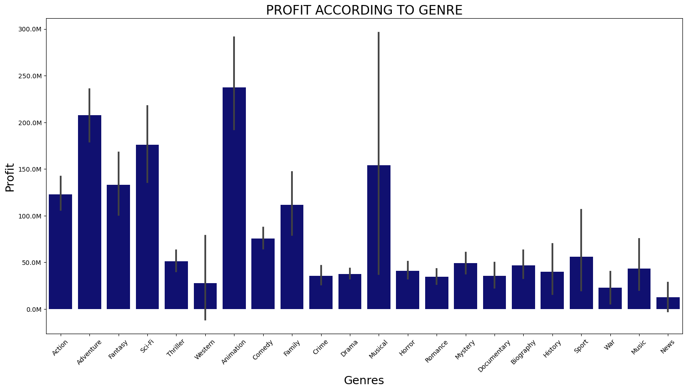
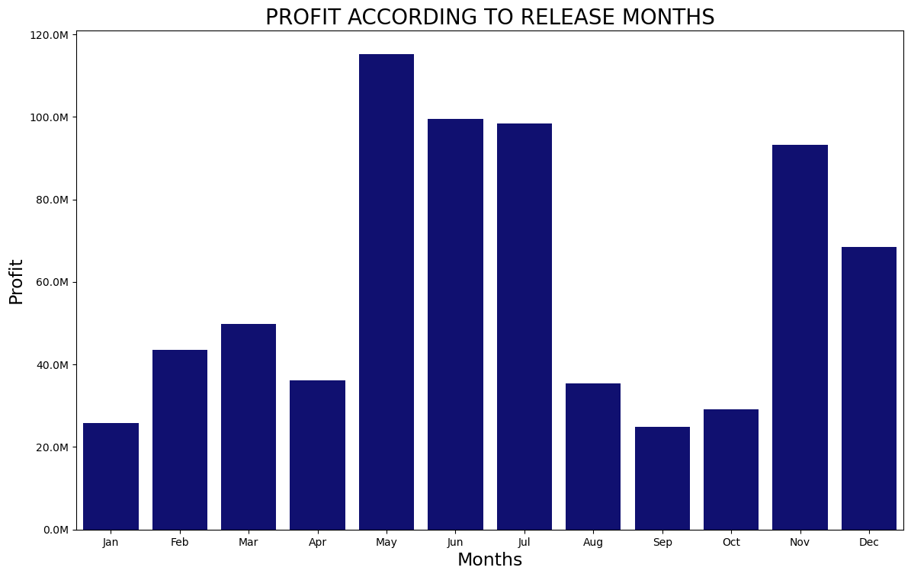
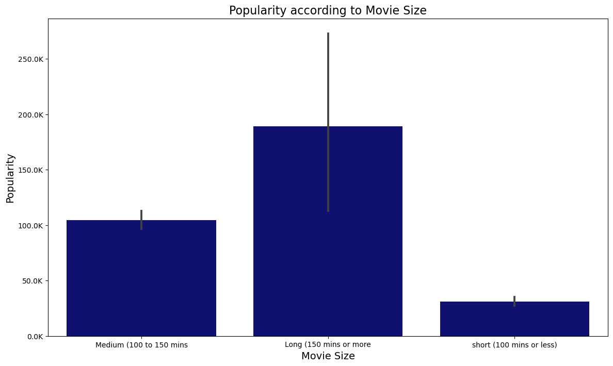
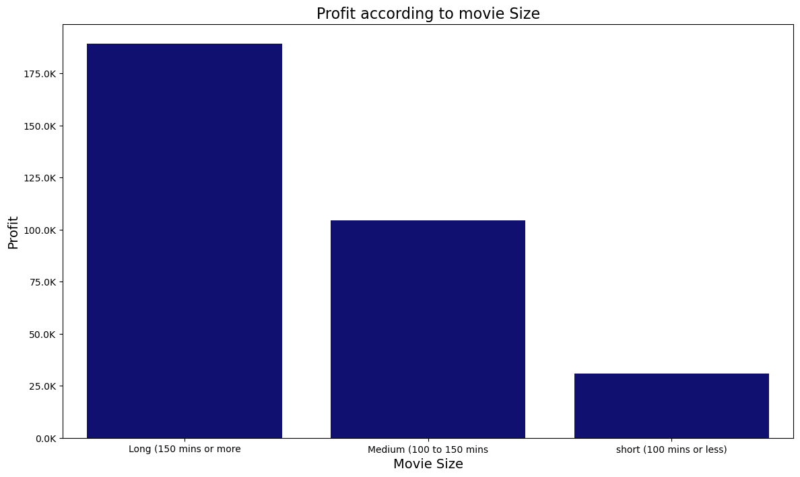

# MOVIE STUDIOS ANALYSIS
BY: Samuel Gichanga

## Project Overview
Use exploratory data analysis to generate insights for a business stakeholder.

## Business Problem
Microsoft sees all the big companies creating original video content and they want to get in on the fun. They have decided to create a new movie studio, but they don’t know anything about creating movies. You are charged with exploring what types of films are currently doing the best at the box office. You must then translate those findings into actionable insights that the head of Microsoft's new movie studio can use to help decide what type of films to create.

## Aims and objectives of the Project.
1. To determine which genres were most profitable.
2. To determine which release months were most profitable.
3. To determine what size of the movies were the most popular.
4. To determine what size of the movies were the most profitable.

## The questions answered by the analysis include.
1. Which genres were the most profitable?
2. Which release months were most profitable?
3. what size of the movies were the most popular?
4. What size of the movies were the most profitable?

## Data.
Three data sets were used and are briefly explained below;
1. imdb.title.basics - contains basic information of the movie titles, this include; primary title, original title, start year, runtime in minutes and genres.
2. imdb.title.ratings - contains information about the votes casted on each movie title and their rating. The info in this data set include; averagerating and numvotes.
3. tn.movie_budgets - contains information about the movie budget, the information include; movie, production budget, domestic gross and worldwide gross.
## Methods used.
Exploratory data analysis was used. the following steps were followed;
- understanding the business problem.
- understanding the data sets presented.
- developing the business questions.
- deciding which data sets to use.
- importing the required libraries.
- loading the datasets.
- data understanding.
- data preparation.
- data cleaning.
- data analysis.
- data visualization.
- answering the business questions.
- making conclusions and recommendations.

## Results of the analysis.
### Which genres were the most profitable?
Animation, adventure and Sci-Fi genres are the leading genres in profit margin as displayed below.

### Which release months were most profitable?
May, june, july were the most profitable release months respectively as displayed below.

### what size of the movies were the most popular?
The long movies that is the movies with 150 or more minutes are the most popular. Followed by the medium sized movies with minutes between 100 to 150 minutes. lastly the short movies with 100 minutes or below are the less popular as displayed below.

### What size of the movies were the most profitable?
The long movies that is the movies with 150 or more minutes are the most profitable. Followed by the medium sized movies with minutes between 100 to 150 minutes. lastly the short movies with 100 minutes or below are the less profitable as displayed below.

## Conclusion and recommendations.
1. According to the analysis of the data, animation, adventure and Sci-Fi genres are the leading genres in profit margin. Hence Microsoft should consider to produce movies with the three genres (animation, adventure and Sci-Fi) in the new movie studio.

2. According to the analysis , May, june, july were the most profitable release months respectively, hence Microsoft should consider to make the new release of the movies in the months of May, june, july since they are the most profitable months.

3. According to the results of the analysis, the long movies (150 minutes and above) were that most popular and most profitable hence Microsoft should consider producing movies that are 150 minutes or more long.

## Further analysis.
Further analysis can be done to determine the relationship between the rating and profit, this will help to know if the movies with the high rating were profitable or what kind of relationship is there between rating and profitability of a movie.

## Limitation.
During the calculation of the profit, only the production budget was included, the marketing and the selling cost was not included.

## For more information.
Get the full data analysis in the 